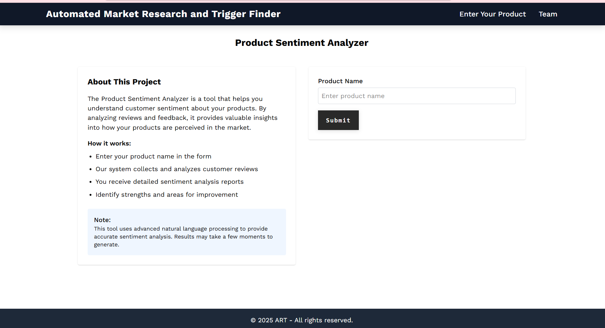

# Automated Ad Research Bot

[](https://art-finder-ui.vercel.app/)

## Overview
This application is designed to assist in the research phase of ad creation by identifying pain points, hooks, and strategies for promoting a product through data-driven insights. The app gathers data from platforms such as YouTube and Reddit, performs competitor analysis, and provides actionable insights into high-performing strategies.

## Demo Screenshot


Here is a look at the application in action.




## Features
- **Data Collection:**
  - Scrapes data from YouTube and Reddit for product-related content.
  - Collects details such as video ID, title, description, likes, dislikes, views, and upvotes/downvotes.

- **Natural Language Processing (NLP):**
  - Identifies customer pain points and common hooks from comments.
  - Performs preprocessing steps like lemmatization, stemming, and handling null values.

- **Visualizations:**
  - Creates word clouds from customer comments to highlight recurring themes and keywords.

- **Sentiment Analysis:**
  - Calculates various sentiment scores:
    - **Score 1:** Likes – Dislikes
    - **Score 2:** Likes / Dislikes
    - **Score 3:** Number of Views
    - **Score 4:** Number of Views / Likes
    - **Score 5:** Number of Views / Dislikes
    - **Score 6:** Score 4 / Score 5
  - Generates graphs to analyze the relationship between sentiment scores and customer feedback.

- **Competitor Analysis:**
  - Provides insights into competitor strategies and identifies high-performing hooks and approaches.

## Workflow
1. **Data Scraping:**
   - Collects data from YouTube videos and Reddit posts related to the target product.
   - Stores data in CSV files with the following columns:
     - **YouTube:** `videoID`, `videoTitle`, `description`, `likes`, `dislikes`, `number of views`
     - **Reddit:** `upvotes`, `downvotes`, `comments`

2. **Data Preprocessing:**
   - Cleans and processes text data.
   - Applies NLP techniques like lemmatization and stemming.
   - Fills in missing values and ensures data consistency.

3. **Analysis and Visualization:**
   - Performs sentiment analysis using predefined scores.
   - Generates word clouds and sentiment graphs to derive actionable insights.

4. **Competitor Insights:**
   - Evaluates competitor strategies based on collected data and performance metrics.

## How to Use
1. Clone the repository:
   ```bash
   git clone https://github.com/kk1701/artFinder-server
   ```

2. Install dependencies:
   ```bash
   pip install -r requirements.txt
   ```

3. Run the application:
   ```bash
   python app.py
   ```

4. Provide input about the product you want to promote.

5. Review the generated analysis and insights.

## Requirements
- Python 3.8+
- Libraries:
  - requests
  - praw
  - python-dotenv
  - pandas
  - numpy
  - fastapi
  - pydantic
  - scikit-learn
  - google_api_python_client
  - nltk
  - textblob
  - wordcloud
- ChartJS

## Problems Faced while building & Solution
The standard YouTube Data API does not allow for direct searching of advertisements. To overcome this, this application employs a strategic workaround: it scrapes and analyzes the most popular public videos related to a given product.

This indirect approach allows the tool to effectively achieve its core research goals, including:

-Performing competitor analysis.

-Identifying high-performing hooks and strategies.

-Analyzing audience sentiment via comments and engagement metrics.

## Future Enhancements
- Automate the data scraping process with scheduled updates(real time data).
- Expand data sources to include platforms like Twitter and Instagram.
- Improve NLP techniques for more accurate sentiment analysis.
- Integrate a user-friendly dashboard for visualizing insights.
- Integrate an LLM API-turns it into a proper conversational bot.(Instead of just viewing a dashboard, a user could ask natural language questions like-Summarize the top three pain points from the Reddit comments. The backend would use the scraped data as context for the LLM to generate a precise answer.)

---


